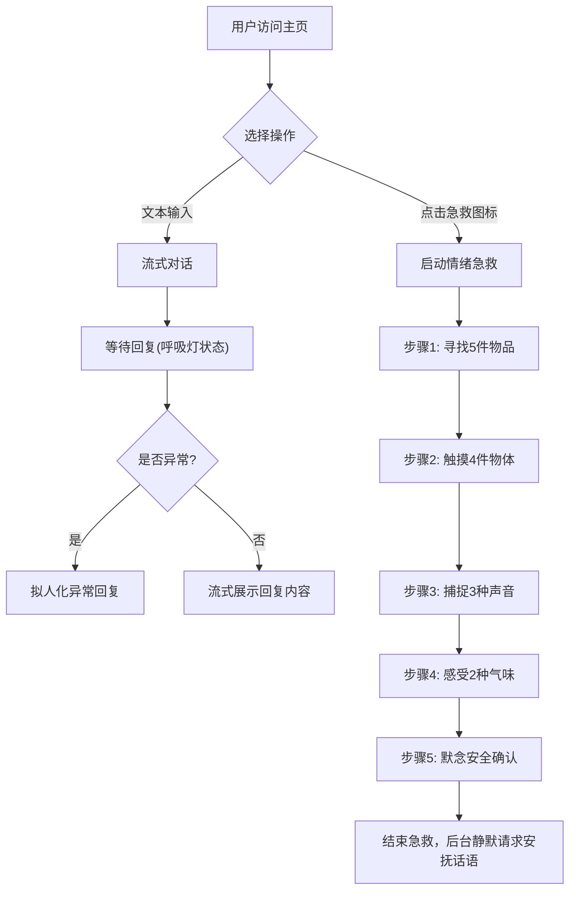

## 1. 产品概述
夜阑树洞 (Night Treehole) 是一个提供心理慰藉与情感支持的在线 Web 应用。
- 去除所有机器与赛博的隐喻，完全围绕“人与人之间的真实心理连接”来设计，打造出“真实的心理咨询室”的温暖氛围。

## 2. 核心功能

### 2.1 核心模块
1. **主对话界面 (Chat Interface)**: 支持流式对话体验，拟人化异常处理，提供“喝口热茶，重新开始”的清空记录功能。
2. **情绪急救模块 (SOS Grounding Module)**: 5步着陆练习 (5-4-3-2-1)，通过全屏毛玻璃和引导文案帮助用户平复情绪。

### 2.2 页面详细说明
| 页面名称 | 模块名称 | 功能描述 |
|-----------|-------------|---------------------|
| 主页 (Home) | 对话模块 | 流式回复，拟人化的等待状态（呼吸灯起伏），隐藏所有 AI 痕迹 |
| 主页 (Home) | 情绪急救模块 | 位于输入框旁的柔和图标（如叶子或漩涡），点击触发全屏毛玻璃覆盖的逐步情绪引导 |

## 3. 核心流程
用户进入主页，可直接与系统进行自然语言的流式对话交流，或者在需要时点击输入框旁的柔和图标进入情绪急救流程。

## 4. 用户界面设计

### 4.1 设计风格
- **色彩心理学**: 放弃深色赛博风。背景采用极度柔和的动态渐变，主色调为“暖茶黄”、“落日橘”与“暮色紫”的缓慢交替。动画周期设置为 20 秒，模拟人在平静状态下的缓慢呼吸。
- **对话框 (Glassmorphism)**: 高级毛玻璃效果 (`backdrop-filter: blur(20px)`，背景白度 10%)。边缘极致圆润，消除生硬的边框线。
- **排版与字体**: 颜色使用柔和的米色/深灰，行距 1.8，字重偏轻，给文字充分的“呼吸感”。
- **状态拟人化**:
  - 无“加载中”、“AI 思考中”文字，等待回复时显示三个柔和发光的圆点，呈现缓慢的呼吸灯起伏。
  - 清空记录按钮文案：“🍵 喝口热茶，重新开始”。
  - 输入框默认文案：“今天过得怎么样？想聊点什么都可以……”

### 4.2 页面设计总览
| 页面名称 | 模块名称 | UI 元素 |
|-----------|-------------|-------------|
| 主页 | 动态背景 | “暖茶黄”、“落日橘”、“暮色紫” 20秒周期渐变交替动画 |
| 主页 | 对话气泡 | 毛玻璃背景，无边框，极度圆润角 |
| 主页 | 状态与交互 | 呼吸灯点等待动画，定制化输入框与按钮文案 |
| 主页 | 急救模块 | 全屏高斯模糊，文字渐隐渐现 (Framer Motion) 过渡动画 |

### 4.3 响应式设计
- 优先支持桌面端，同时完美适配移动端屏幕。交互友好，确保动画平滑无卡顿。