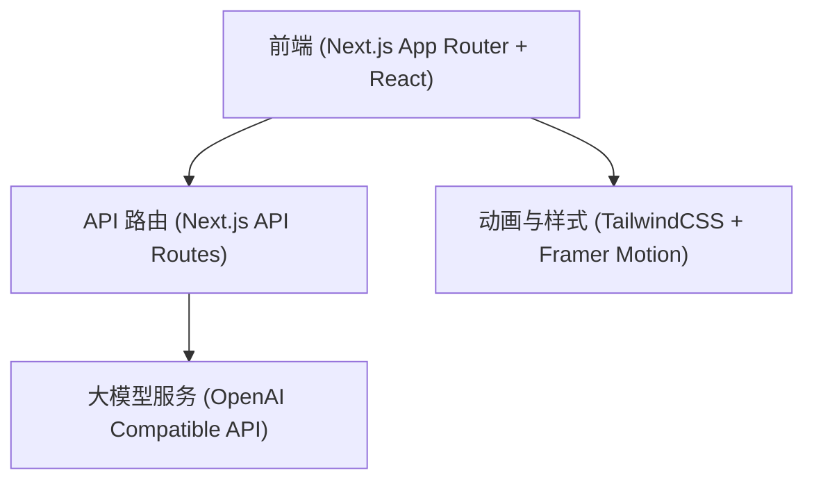

## 1. 架构设计


## 2. 技术栈说明
- **前端框架**: Next.js (App Router) + React
- **样式与动画**: TailwindCSS + Framer Motion (处理所有平滑过渡和呼吸灯动画)
- **后端/API**: Next.js API Routes (用于处理大模型对话流)
- **大模型接入**: OpenAI 兼容 SDK (流式输出 Stream)

## 3. 路由定义
| 路由 | 用途 |
|-------|---------|
| `/` | 唯一的单页面，包含对话主界面与情绪急救模块 |
| `/api/chat` | 后端 API，用于处理流式对话，内置硬编码的 System Prompt |

## 4. API 定义
### /api/chat
- **方法**: POST
- **请求体**: 
  ```typescript
  {
    messages: { role: 'user' | 'assistant', content: string }[];
    isSilentMode?: boolean; // 用于情绪急救结束后的静默请求
  }
  ```
- **系统提示词 (硬编码)**: 
  “你现在的身份是一位温暖、耐心、富有同理心的心理咨询师。绝对禁止暴露AI身份，永远不要使用‘作为一个AI’、‘程序’等词汇。你的回复必须像真实人类一样自然，多用短句，语气和缓。在给出建议前，必须先接纳和确认用户的情绪。不要使用1. 2. 3. 的机械排版。你提供支持和引导，但不替用户做决定。”
- **响应**: Server-Sent Events (SSE) 流式返回文本。

## 5. 组件划分
1. `ChatLayout`: 包含动态渐变背景。
2. `MessageList`: 消息列表展示，包含气泡的毛玻璃效果。
3. `ChatInput`: 输入框模块，包含“喝口茶”按钮和急救入口图标。
4. `SOSGrounding`: 情绪急救模块（全屏覆盖、步骤切换逻辑）。
5. `TypingIndicator`: 拟人化呼吸灯等待动画组件。